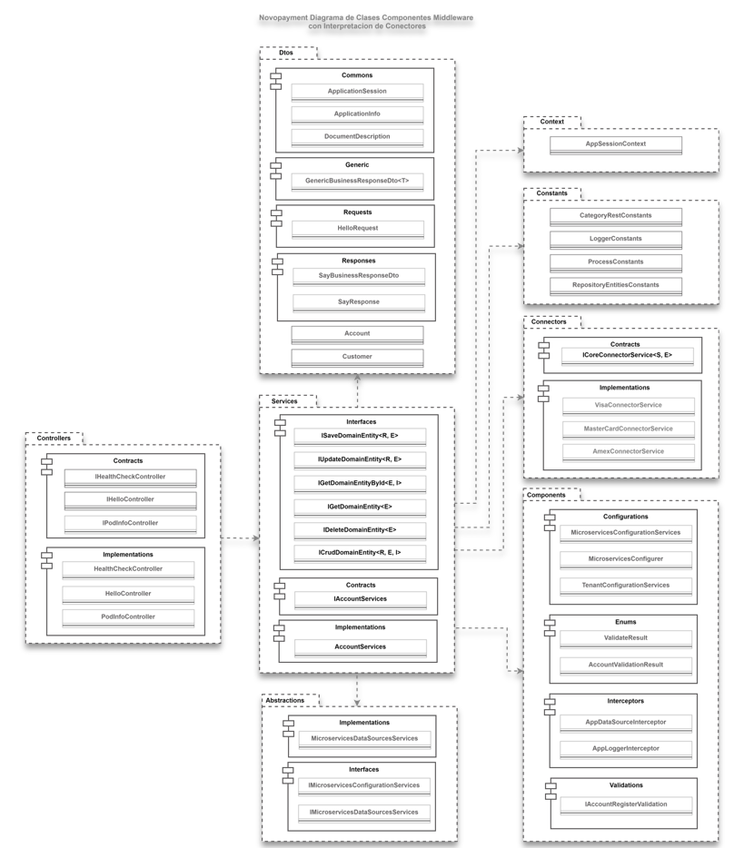
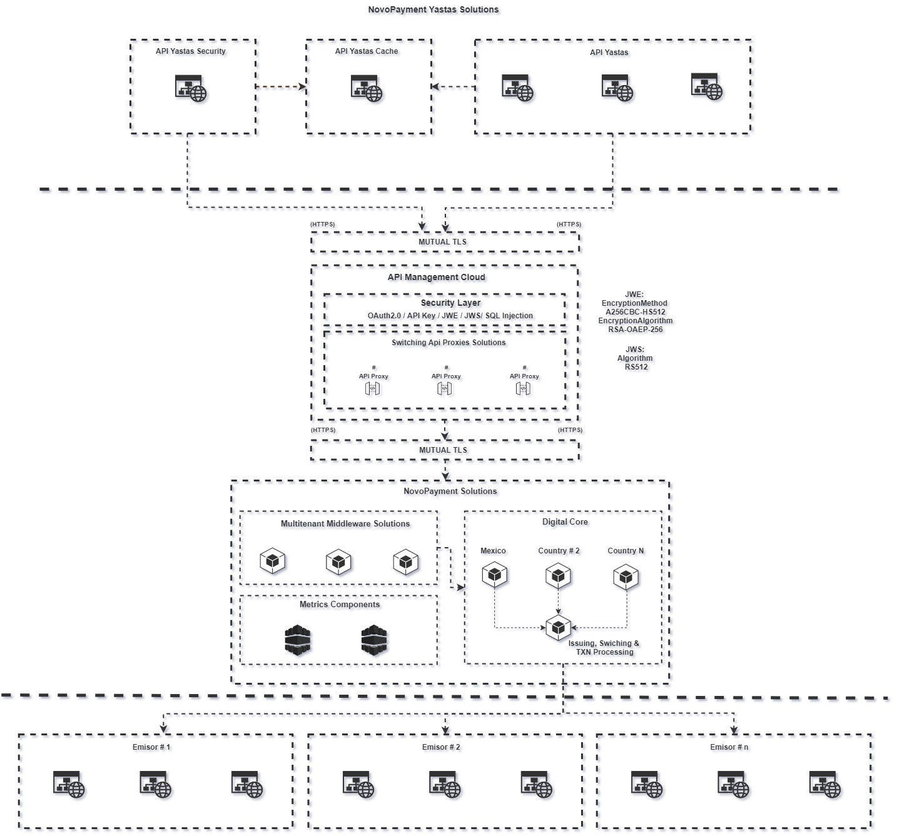
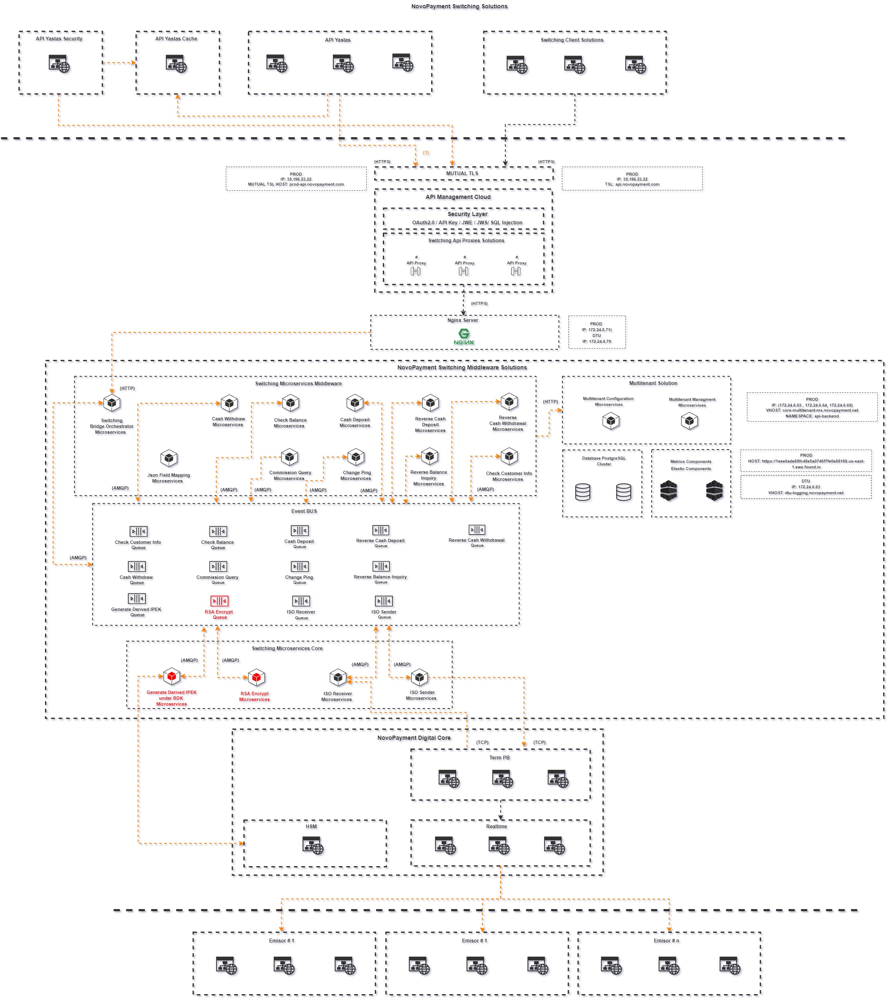
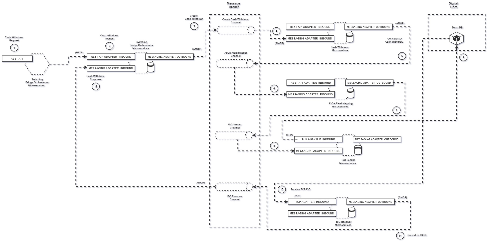
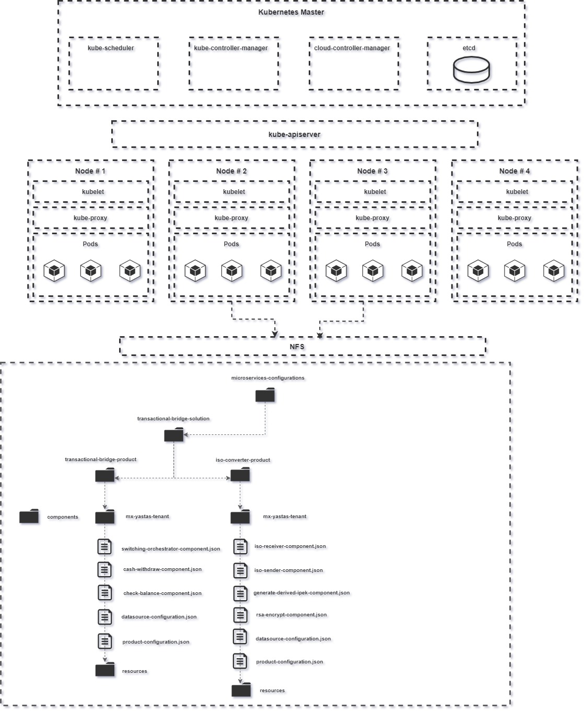

# Transactional Bridge Solutions

orchestrator

Microservicio que escucha eventos, genera log de mensajería, persiste la meta data de las transacciones y el evento en la base de datos, enriquece el evento con la información pertinente de la funcionalidad y demás cambios, para luego generar un evento para el Json Field Mapping.

* [Dependencias Externas](#external-dependencies)
* [Dependencias Internas](#internal-dependencies)
* [Diagrama](#diagrama)

        <dependency>
			<groupId>nl.jqno.equalsverifier</groupId>
			<artifactId>equalsverifier</artifactId>
			<version>3.4.1</version>
			<scope>test</scope>
		</dependency>

		<dependency>
			<groupId>com.jparams</groupId>
			<artifactId>to-string-verifier</artifactId>
			<version>1.4.8</version>
		</dependency>

		<dependency>
			<groupId>org.apache.logging.log4j</groupId>
			<artifactId>log4j-api</artifactId>
			<version>2.6.1</version>
		</dependency>

		<dependency>
			<groupId>org.apache.logging.log4j</groupId>
			<artifactId>log4j-core</artifactId>
			<version>2.6.1</version>
		</dependency>

		<dependency>
			<groupId>org.projectlombok</groupId>
			<artifactId>lombok</artifactId>
			<version>1.18.10</version>
			<type>jar</type>
		</dependency>

		<dependency>
			<groupId>javax.json.bind</groupId>
			<artifactId>javax.json.bind-api</artifactId>
			<version>1.0</version>
		</dependency>

		<dependency>
			<groupId>org.eclipse</groupId>
			<artifactId>yasson</artifactId>
			<version>1.0</version>
		</dependency>

		<dependency>
			<groupId>org.glassfish</groupId>
			<artifactId>javax.json</artifactId>
			<version>1.1</version>
		</dependency>

		<dependency>
			<groupId>com.google.code.findbugs</groupId>
			<artifactId>annotations</artifactId>
			<version>3.0.1</version>
			<scope>compile</scope>
		</dependency>

		<dependency>
			<groupId>com.google.code.findbugs</groupId>
			<artifactId>jsr305</artifactId>
			<version>3.0.1</version>
			<scope>compile</scope>
		</dependency>

		<dependency>
			<groupId>org.apache.commons</groupId>
			<artifactId>commons-lang3</artifactId>
			<version>3.11</version>
		</dependency>

		<dependency>
			<groupId>org.springdoc</groupId>
			<artifactId>springdoc-openapi-ui</artifactId>
			<version>1.5.0</version>
		</dependency>

		<dependency>
			<groupId>org.springdoc</groupId>
			<artifactId>springdoc-openapi-data-rest</artifactId>
			<version>1.5.0</version>
		</dependency>

        <!-- BEGIN DEPENDENCIES MICROSERVICES LIBRARIES -->
        <dependency>
            <groupId>com.novo.microservices.utils</groupId>
            <artifactId>novo-microservices-utils-configurations-loader</artifactId>
            <version>4.0.0</version>
            <exclusions>
                <exclusion>
                    <groupId>org.springframework.boot</groupId>
                    <artifactId>spring-boot-starter-web</artifactId>
                </exclusion>
            </exclusions>
        </dependency>
        <dependency>
            <groupId>com.novo.microservices.utils</groupId>
            <artifactId>novo-microservices-utils-security-encryption</artifactId>
            <version>4.2.0</version>
            <exclusions>
                <exclusion>
                    <groupId>org.springframework.boot</groupId>
                    <artifactId>spring-boot-starter-web</artifactId>
                </exclusion>
            </exclusions>
        </dependency>
        <dependency>
            <groupId>com.novo.microservices.utils</groupId>
            <artifactId>novo-microservices-utils-security-jwa</artifactId>
            <version>4.1.0</version>
            <exclusions>
                <exclusion>
                    <groupId>org.springframework.boot</groupId>
                    <artifactId>spring-boot-starter-web</artifactId>
                </exclusion>
            </exclusions>
        </dependency>
        <dependency>
            <groupId>com.novo.microservices.utils</groupId>
            <artifactId>novo-microservices-utils-multi-tenant-repository</artifactId>
            <version>3.1.0</version>
            <exclusions>
                <exclusion>
                    <groupId>org.springframework.boot</groupId>
                    <artifactId>spring-boot-starter-web</artifactId>
                </exclusion>
            </exclusions>
        </dependency>
        <dependency>
            <groupId>com.novo.microservices.utils</groupId>
            <artifactId>novo-microservices-utils</artifactId>
            <version>3.1.0</version>
            <exclusions>
                <exclusion>
                    <groupId>org.springframework.boot</groupId>
                    <artifactId>spring-boot-starter-web</artifactId>
                </exclusion>
            </exclusions>
        </dependency>
        <dependency>
            <groupId>com.novo.microservices.utils</groupId>
            <artifactId>novo-microservices-common-utils</artifactId>
            <version>3.1.0</version>
            <exclusions>
                <exclusion>
                    <groupId>org.springframework.boot</groupId>
                    <artifactId>spring-boot-starter-web</artifactId>
                </exclusion>
            </exclusions>
        </dependency>
        <dependency>
            <groupId>com.novo.microservices.utils</groupId>
            <artifactId>novo-microservices-common-repository-utils</artifactId>
            <version>4.0.0</version>
            <exclusions>
                <exclusion>
                    <groupId>org.springframework.boot</groupId>
                    <artifactId>spring-boot-starter-web</artifactId>
                </exclusion>
            </exclusions>
        </dependency>
        <dependency>
            <groupId>com.novo.microservices.utils</groupId>
            <artifactId>novo-microservices-utils-messaging-broker</artifactId>
            <version>1.0.0</version>
            <exclusions>
                <exclusion>
                    <groupId>org.springframework.boot</groupId>
                    <artifactId>spring-boot-starter-web</artifactId>
                </exclusion>
            </exclusions>
        </dependency>
        <dependency>
            <groupId>com.novo.microservices.utils</groupId>
            <artifactId>novo-microservices-tbs-common-utils</artifactId>
            <version>0.1.0</version>
            <exclusions>
                <exclusion>
                    <groupId>org.springframework.boot</groupId>
                    <artifactId>spring-boot-starter-web</artifactId>
                </exclusion>
            </exclusions>
        </dependency>
        <!-- END DEPENDENCIES MICROSERVICES LIBRARIES -->

© 2022 NovoPayment Inc. All rights reserved
